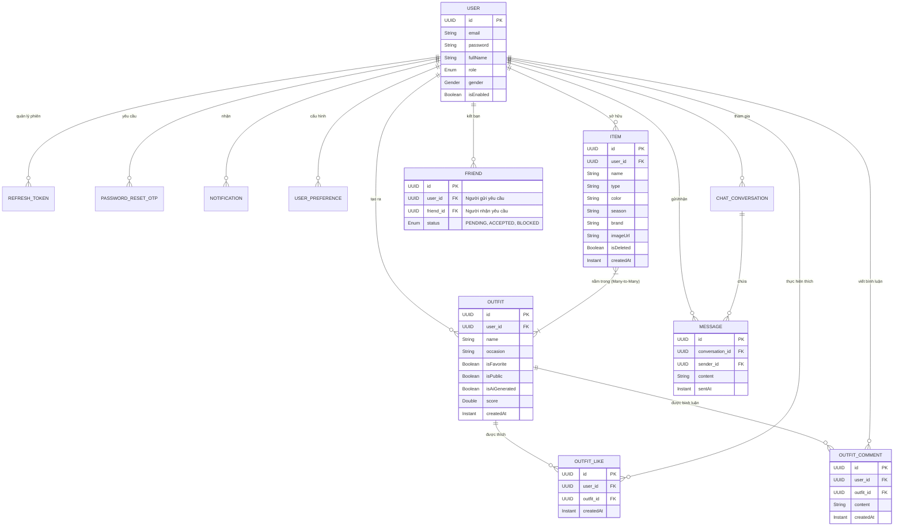

# 📊 Sơ đồ Cơ sở Dữ liệu Toàn diện (Wardrobe & Outfit System)

Tài liệu này mô tả chi tiết toàn bộ cấu trúc các bảng dữ liệu, quan hệ và mục đích của từng thực thể trong hệ thống.

## 1. Sơ đồ Quan hệ Thực thể (ERD)

## 2. Chi tiết các Module

### A. Module Wardrobe (Tủ đồ)
*   **Item**: Lưu trữ thông tin từng món đồ cá nhân.
    *   `isDeleted`: Dùng cho tính năng **Soft Delete** (Xóa tạm thời).

### B. Module Outfits (Phối đồ)
*   **Outfit**: Lưu trữ bộ trang phục được kết hợp từ nhiều Items.
    *   Quan hệ Nhiều-Nhiều với Item thông qua bảng trung gian `outfit_items`.

### C. Module Social (Xã hội)
*   **Friend**: Quản lý mối quan hệ bạn bè giữa các người dùng.
*   **ChatConversation & Message**: Hệ thống tin nhắn thời gian thực.

### D. Module System (Hệ thống)
*   **RefreshToken**: Bảo mật phiên đăng nhập.
*   **Notification**: Gửi các gợi ý phối đồ hoặc thông báo tương tác.
*   **UserPreference**: Lưu sở thích cá nhân.

---
*Tài liệu này được lưu trực tiếp vào thư mục dự án bởi Antigravity.*
