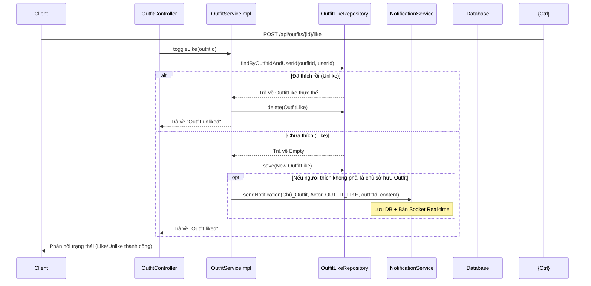
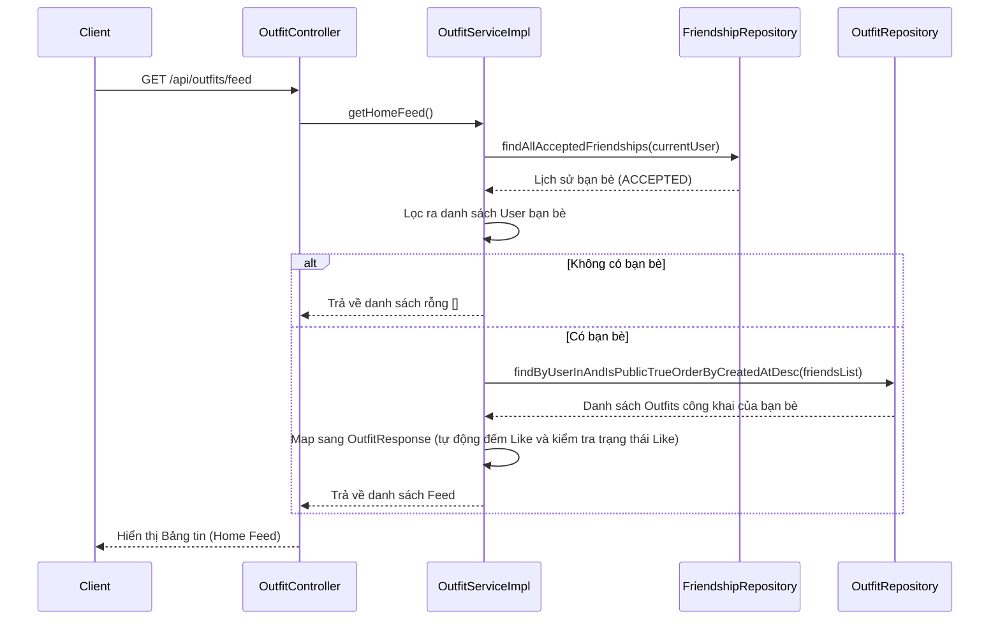

# Kế hoạch tích hợp tính năng Thích Outfit và API Bảng Tin (Home Feed)

Để hoàn thiện bảng task **Notifications & Feed** hiện tại của bạn, chúng ta sẽ bắt tay vào triển khai nốt các tính năng còn thiếu bao gồm:
1. **Tính năng Thích/Bỏ thích Outfit (Outfit Like)**: Lưu vào DB, hỗ trợ đếm số lượt thích, trạng thái đã thích hay chưa của User hiện tại, và tự động bắn thông báo Real-time (Socket.io + DB) tới chủ sở hữu Outfit.
2. **API Bảng tin (Home Feed)**: Lấy danh sách các Outfit công khai (`isPublic = true`) của những người bạn đã kết nối (`ACCEPTED`), sắp xếp theo thời gian mới nhất (`createdAt DESC`).

---

## 1. Thiết Kế Luồng Xử Lý (Mermaid Sequence)

### A. Luồng Thích Outfit (Toggle Outfit Like)

### B. Luồng Tải Bảng Tin (Home Feed API)

---

## 2. Các File Sẽ Chỉnh Sửa & Tạo Mới

### 📂 [MODIFY] `OutfitLikeRepository.java`
Thêm các câu truy vấn cần thiết để đếm Like và kiểm tra trạng thái:
- `Optional<OutfitLike> findByOutfitIdAndUserId(UUID outfitId, UUID userId);`
- `long countByOutfitId(UUID outfitId);`
- `boolean existsByOutfitIdAndUserId(UUID outfitId, UUID userId);`

### 📂 [MODIFY] `OutfitRepository.java`
Thêm hàm tìm kiếm Outfit của danh sách bạn bè:
- `List<Outfit> findByUserInAndIsPublicTrueOrderByCreatedAtDesc(List<User> users);`

### 📂 [MODIFY] `OutfitResponse.java` (trong `dto/response/`)
Bổ sung các trường thông tin để hiển thị tương tác:
- `long likeCount` (Tổng số lượt thích của Outfit này)
- `boolean isLiked` (User hiện tại đang xem đã thích Outfit này hay chưa)
- `String ownerName` (Tên của chủ sở hữu Outfit - cần thiết để hiện trên Bảng tin)
- `String ownerAvatar` (Ảnh đại diện của chủ sở hữu Outfit)

### 📂 [MODIFY] `OutfitService.java` & `OutfitServiceImpl.java`
1. **Inject thêm** `OutfitLikeRepository` và `FriendshipRepository` vào `OutfitServiceImpl`.
2. **Cập nhật hàm `mapToOutfitResponse(Outfit outfit)`**:
   - Sử dụng `OutfitLikeRepository` để đếm số Like (`countByOutfitId`).
   - Kiểm tra xem người dùng hiện tại đã thích chưa (`existsByOutfitIdAndUserId`).
   - Đọc thông tin `ownerName` và `ownerAvatar` từ `outfit.getUser()`.
3. **Thêm phương thức Thích Outfit**:
   - `String toggleLike(UUID outfitId)`
4. **Thêm phương thức Lấy Bảng Tin**:
   - `List<OutfitResponse> getHomeFeed()`

### 📂 [MODIFY] `OutfitController.java`
Expose 2 API mới cho Client:
- `POST /api/outfits/{id}/like` (Thích/Bỏ thích Outfit)
- `GET /api/outfits/feed` (Tải bảng tin các hoạt động của bạn bè)

---

## 3. Kế Hoạch Xác Minh (Verification Plan)

### A. Kiểm tra tự động
- Chạy lệnh kiểm tra biên dịch dự án: `.\gradlew compileJava`.

### B. Kiểm tra thủ công (Postman)
1. **Test Toggle Like**:
   - Dùng tài khoản A thích Outfit của tài khoản B -> Kiểm tra Database xem bảng `outfit_likes` có thêm bản ghi mới.
   - Tài khoản B online -> Xem Socket.io có nhận được sự kiện `"new_notification"` báo A đã thích Outfit hay không.
   - Gọi lại API thích lần nữa -> Kiểm tra xem bản ghi trong DB có tự động xóa đi (Unlike) hay không.
2. **Test Home Feed**:
   - Tạo mối quan hệ bạn bè `ACCEPTED` giữa A và B.
   - B tạo 2 Outfit ở chế độ công khai (`isPublic = true`) và 1 Outfit ở chế độ riêng tư (`isPublic = false`).
   - A gọi API `/api/outfits/feed` -> Phải nhận được đúng 2 Outfit công khai của B, sắp xếp theo thứ tự mới nhất lên đầu.

---

## 💬 Câu Hỏi Cho Bạn:
> [!IMPORTANT]
> 1. Trạng thái phản hồi của API **Like Outfit**: Bạn muốn API trả về một chuỗi thông báo đơn giản (ví dụ: `"Liked"` / `"Unliked"`) hay trả về một Object chứa thông tin cập nhật (ví dụ: `{ "liked": true, "likeCount": 15 }`) để Frontend dễ cập nhật giao diện? (Đề xuất: Trả về Object `{ "liked": boolean, "likeCount": long }` sẽ chuyên nghiệp và tiện lợi hơn cho Frontend).
> 2. Bạn có đồng ý với phương án tích hợp chung API Bảng tin vào **`OutfitController`** không, hay muốn tách riêng ra một `FeedController` riêng biệt để mở rộng sau này (ví dụ sau này Feed có thêm tin bài, ảnh check-in...)?

Hãy xem qua và cho tôi xin nhận xét nhé! Nếu bạn thấy kế hoạch này đã quá chuẩn chỉnh, hãy gõ **"Duyệt"** để chúng ta bắt tay vào viết code luôn!
