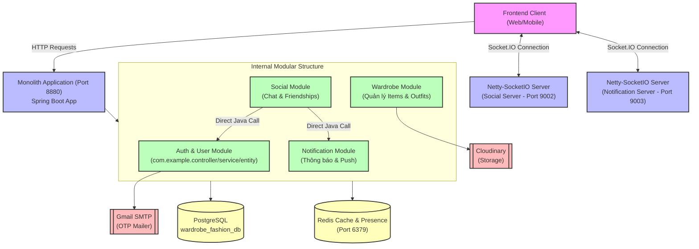

# Kiến trúc Hệ thống & Luồng dữ liệu (System Architecture & Data Flows)

Tài liệu này cung cấp cái nhìn chi tiết về kiến trúc hệ thống dạng **Modular Monolith** (Đơn thể dạng Module) của dự án **Fashion Outfit Suggestions Application**, các công nghệ cốt lõi được áp dụng, và các sơ đồ chuỗi (Sequence Diagrams) mô tả luồng di chuyển dữ liệu của các usecase chính trong hệ thống sau khi đã hợp nhất toàn bộ dịch vụ.

---

## I. Tổng quan Kiến trúc Hệ thống (System Architecture)

Dự án đã được chuyển đổi hoàn toàn từ kiến trúc Microservices phân tán sang mô hình **Modular Monolith**. Tất cả các dịch vụ (Auth, Wardrobe, Social, Notification) hiện tại được cấu trúc dưới dạng các module (package) nội bộ trong cùng một ứng dụng Spring Boot duy nhất, chia sẻ chung một cơ sở dữ liệu PostgreSQL thống nhất.

### 1. Sơ đồ khối kiến trúc tổng quát



### 2. Chi tiết các thành phần trong hệ thống

| Tên Module | Tải Nguyên / Cổng | Cơ sở dữ liệu | Vai trò chính | Tích hợp bên ngoài |
| :--- | :---: | :--- | :--- | :--- |
| **Monolith Web Server** | `8880` (Tomcat) | PostgreSQL `wardrobe_fashion_db` | Đóng vai trò là entry point duy nhất cho các API HTTP. Nhận các request từ Web/Mobile Client và điều hướng trực tiếp bằng các Controller nội bộ. | |
| **Auth & User Module** | Chạy chung `8880` | PostgreSQL `wardrobe_fashion_db` | Đăng ký, đăng nhập, phân quyền, quản lý JWT (Access Token & Refresh Token), tìm kiếm profile user, quản lý trạng thái online/offline (presence). | **Redis** (Presence cache), **Gmail SMTP** (Gửi mã OTP). |
| **Wardrobe Module** | Chạy chung `8880` | PostgreSQL `wardrobe_fashion_db` | Quản lý tủ đồ cá nhân (tải lên trang phục - Items), phối đồ (Outfits), phối đồ gợi ý tự động, quản lý thùng rác & khôi phục dữ liệu. | **Cloudinary** (Lưu trữ ảnh trang phục). |
| **Social Module** | Chạy chung `8880` | PostgreSQL `wardrobe_fashion_db` | Quản lý quan hệ bạn bè (Friendship), nhắn tin trực tiếp (Chat), thích trang phục công khai (Outfit Like). | **Netty-SocketIO Server** (Chạy độc lập trên cổng `9002` để đẩy tin nhắn real-time). |
| **Notification Module** | Chạy chung `8880` | PostgreSQL `wardrobe_fashion_db` | Quản lý thông báo trong ứng dụng (thông báo kết bạn, tin nhắn mới, lượt thích trang phục). | **Netty-SocketIO Server** (Chạy độc lập trên cổng `9003` để đẩy thông báo real-time). |

---

## II. Các Luồng Di Chuyển Dữ Liệu Usecase (Key Data Flows)

Dưới đây là sơ đồ chuỗi (Sequence Diagrams) thể hiện cách dữ liệu di chuyển trực tiếp trong cấu trúc Đơn thể (Monolith), loại bỏ hoàn toàn độ trễ mạng của các dịch vụ trung gian cũ (Feign Client, API Gateway).

### Usecase 1: Đăng nhập & Xác thực người dùng (Auth & JWT Flow)

Luồng xử lý khi người dùng gửi yêu cầu đăng nhập bằng Email & Mật khẩu để nhận JWT.

```mermaid
sequenceDiagram
    autonumber
    actor User as Người dùng (Client)
    participant Tomcat as Web Server (8880)
    participant Auth as Auth Module (Java Class)
    database DB as PostgreSQL (wardrobe_fashion_db)
    database Redis as Redis Cache

    User->>Tomcat: POST /api/auth/login {email, password}
    Tomcat->>Auth: Gọi AuthController.login() trực tiếp
    Note over Auth: Kiểm tra định dạng dữ liệu & Validation
    Auth->>DB: Truy vấn User theo Email
    DB-->>Auth: Trả về thông tin User (đã mã hóa password)
    
    alt Kiểm tra mật khẩu thành công
        Auth->>Auth: Khớp mật khẩu (BCryptPasswordEncoder)
        Auth->>Auth: Sinh Access Token (JWT - hạn ngắn) & Refresh Token (UUID - hạn dài)
        Auth->>Redis: Lưu trữ Refresh Token đối chiếu
        Auth-->>Tomcat: Trả về ApiResponse {accessToken, refreshToken}
        Tomcat-->>User: Phản hồi 200 OK kèm cặp Tokens
    else Mật khẩu hoặc Email sai
        Auth-->>Tomcat: Quăng AppException (ERR_BAD_CREDENTIALS)
        Tomcat-->>User: Phản hồi lỗi 400 Bad Request / 401 Unauthorized
    end
```

---

### Usecase 2: Thêm Trang Phục & Tải ảnh lên Cloudinary (Add Item Flow)

Luồng tải ảnh trang phục dạng `multipart/form-data` và lưu thông tin vào Tủ đồ (Wardrobe).

```mermaid
sequenceDiagram
    autonumber
    actor User as Người dùng (Client)
    participant Tomcat as Web Server (8880)
    participant Wardrobe as Wardrobe Module (Java Class)
    participant Cloudinary as Cloudinary API
    database DB as PostgreSQL (wardrobe_fashion_db)

    User->>Tomcat: POST /api/items/add (Multipart: data JSON + file Image) <br>[Header: Bearer token]
    Note over Tomcat: Spring Security xác thực JWT và nạp thông tin vào SecurityContext
    Tomcat->>Wardrobe: Gọi ItemController.addItem() trực tiếp
    Note over Wardrobe: Lấy userId từ SecurityContext nội bộ
    
    Wardrobe->>Cloudinary: Gọi CloudinaryService.upload (API upload ảnh trực tiếp)
    Cloudinary-->>Wardrobe: Trả về Secure URL ảnh (ví dụ: https://res.cloudinary.com/...)
    
    Wardrobe->>Wardrobe: Thiết lập imageUrl vào ItemRequest
    Wardrobe->>DB: Insert bản ghi Item mới vào bảng 'item'
    DB-->>Wardrobe: Trả về thực thể Item đã lưu
    
    Wardrobe-->>Tomcat: Trả về ApiResponse<ItemResponse>
    Tomcat-->>User: Trả về dữ liệu trang phục đã thêm thành công
```

---

### Usecase 3: Gửi Lời Mời Kết Bạn & Giao Tiếp Nội Bộ (Send Friend Request Flow)

Giao tiếp nội bộ bằng cách tiêm trực tiếp Java Service (`@Autowired`) thay vì gọi mạng Feign Client.

```mermaid
sequenceDiagram
    autonumber
    actor User1 as User A (Client)
    participant Tomcat as Web Server (8880)
    participant Social as Social Module (FriendshipService)
    participant Auth as Auth Module (UserService)
    participant Notif as Notification Module (NotificationService)
    database DB as PostgreSQL (wardrobe_fashion_db)

    User1->>Tomcat: POST /api/friendship/request/{receiverId} [Header: Bearer UserA_Token]
    Tomcat->>Social: Gọi FriendshipController.sendFriendRequest()
    Note over Social: Lấy thông tin User A từ SecurityContext nội bộ
    
    %% Gọi trực tiếp thông qua Java Dependency Injection
    rect rgb(230, 245, 255)
        Note over Social, Auth: Java Method Call (Direct Injection)
        Social->>Auth: userService.getUserProfile(receiverId)
        Auth-->>Social: Trả về UserProfileResponse (không thông qua mạng HTTP)
    end

    alt User B không tồn tại
        Social-->>Tomcat: Ném lỗi USER_NOT_FOUND
        Tomcat-->>User1: Trả về lỗi 404
    else User B hợp lệ
        Social->>DB: Truy vấn dữ liệu bạn bè cũ
        DB-->>Social: Trả về rỗng (Chưa kết bạn)
        Social->>DB: Lưu bản ghi mới vào bảng 'friendship' (status=PENDING)
        DB-->>Social: Trả về bản ghi Friendship thành công
        
        %% Gọi dịch vụ thông báo nội bộ
        rect rgb(240, 255, 240)
            Note over Social, Notif: Java Method Call (Direct Injection)
            Social->>Notif: notificationService.sendNotification(recipientId=B, actorId=A, type=FRIEND_REQUEST, ...)
            Note over Notif: NotificationService lưu vào bảng 'notification' & đẩy ra Socket.IO cổng 9003
            Notif-->>Social: Trả về thành công (Void)
        end

        Social-->>Tomcat: Trả về chuỗi: "Request has been sent"
        Tomcat-->>User1: Phản hồi 200 OK gửi lời mời kết bạn thành công
    end
```

---

### Usecase 4: Nhắn Tin Trực Tiếp & Real-time Presence (SocketIO & Chat Flow)

Sơ đồ kết hợp giữa luồng HTTP của Monolith Server và hệ thống đa luồng WebSocket của Netty-SocketIO hoạt động song song.

```mermaid
sequenceDiagram
    autonumber
    actor UserA as User A (Client)
    actor UserB as User B (Client)
    participant SocialSocket as Social SocketIO Server (Port 9002)
    participant Tomcat as Monolith HTTP Server (Port 8880)
    participant Social as Social Module (ChatService)
    participant NotifSocket as Notification SocketIO Server (Port 9003)
    database DB as PostgreSQL (wardrobe_fashion_db)

    %% Khởi động & Connect Socket
    Note over UserA, SocialSocket: ─── LUỒNG KẾT NỐI SOCKET & ĐỒNG BỘ TRẠNG THÁI (PRESENCE) ───
    UserA->>SocialSocket: Khởi tạo kết nối Socket.IO kèm token
    Note over SocialSocket: Xác thực token hợp lệ & Giải mã lấy userId A
    
    rect rgb(230, 245, 255)
        SocialSocket->>Tomcat: Cập nhật trạng thái thông qua userService.updatePresence(A, true)
        Tomcat-->>SocialSocket: Cập nhật DB thành công
    end
    
    SocialSocket->>SocialSocket: User A gia nhập phòng (Room) cá nhân của mình
    SocialSocket->>UserB: Phát sự kiện broadcast "user_status" thông báo User A Online
    
    %% Luồng gửi tin nhắn
    Note over UserA, Social: ─── LUỒNG GỬI TIN NHẮN CHAT & THÔNG BÁO ───
    UserA->>Tomcat: HTTP POST /api/chat/send {conversationId, content}
    Tomcat->>Social: Gọi ChatService.sendMessage() trực tiếp
    Social->>DB: Lưu tin nhắn mới vào bảng 'message'
    DB-->>Social: Trả về Message entity đã lưu
    
    %% Phát real-time qua Social Socket
    Social->>SocialSocket: Lấy Room theo conversationId
    SocialSocket->>UserB: socket.sendEvent("new_message", MessageResponse) [Real-time Chat]
    
    %% Gửi thông báo real-time qua Notification Socket (Port 9003)
    rect rgb(240, 255, 240)
        Social->>DB: Lưu bản ghi thông báo mới vào bảng 'notification'
        Social->>NotifSocket: Lấy Room theo userId B
        NotifSocket->>UserB: socket.sendEvent("new_notification", NotificationResponse)
    end
    
    Social-->>Tomcat: Trả về MessageResponse
    Tomcat-->>UserA: Trả về phản hồi tin nhắn thành công
```

---

## III. Các Cơ Chế Kỹ Thuật Đặc Biệt (Architectural Design Highlights)

### 1. Hợp nhất Cơ sở dữ liệu (Single Shared Database)
* **Loại bỏ Database phân tán**: Chuyển đổi toàn bộ các database cũ (`db_wardrobe`, `db_social`, `db_notification`) gộp chung vào cơ sở dữ liệu duy nhất **`wardrobe_fashion_db`**.
* **Đồng bộ hóa Schema**: Sử dụng Hibernate `ddl-auto: update` giúp tự động sinh bảng, cập nhật các ràng buộc dữ liệu trực tiếp trong runtime mà không sợ lỗi xung đột môi trường.
* **Tối ưu hóa Truy vấn**: Giờ đây các module có thể thực hiện truy vấn trực tiếp với liên kết bảng JPA `@ManyToMany`, `@ManyToOne` (ví dụ: liên kết trực tiếp thực thể `Outfit` với `Item`) thay vì phải thực hiện ghép nối thủ công phức tạp như trước.

### 2. Thiết lập Đa Máy chủ Socket.IO Độc lập
Để duy trì tính toàn vẹn của các tính năng real-time nguyên bản mà không bị chồng chéo sự kiện:
* **Social SocketIO Server**: Lắng nghe và điều phối các sự kiện chat, trạng thái bạn bè trực tuyến (Presence) hoạt động trên cổng riêng **`9002`**.
* **Notification SocketIO Server**: Lắng nghe và điều phối các cảnh báo hệ thống, lời mời kết bạn tức thời chạy độc lập trên cổng **`9003`**.
* Cả hai máy chủ chạy song song dạng các luồng phụ (threads) bên trong ứng dụng Spring Boot thông qua cơ chế `CommandLineRunner` (`SocketIORunner` và `NotificationSocketIORunner`).

### 3. Giao tiếp Nội bộ Trực tiếp (Direct Java Injections)
* Loại bỏ hoàn toàn **Netflix Eureka Server** và **Spring Cloud API Gateway**. Sự phức tạp trong việc đăng ký dịch vụ mạng không còn cần thiết.
* Thay thế toàn bộ Feign Clients (`UserClient`, `NotificationClient`, v.v.) bằng cơ chế Inject Bean trực tiếp của Spring Core. Việc giao tiếp giữa các module diễn ra trực tiếp qua các lệnh gọi phương thức Java thuần túy, tăng tốc độ xử lý lên gấp nhiều lần và giảm độ phức tạp khi gỡ lỗi (debugging).
