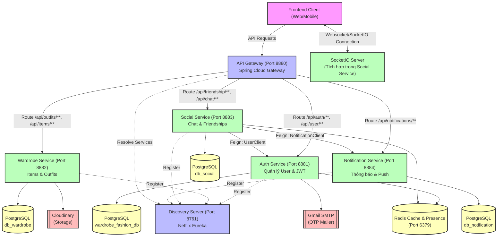

# Kiến trúc Hệ thống & Luồng dữ liệu (System Architecture & Data Flows)

Tài liệu này cung cấp cái nhìn chi tiết về kiến trúc hệ thống dạng **Microservices** của dự án **Fashion Outfit Suggestions Application**, các công nghệ cốt lõi được áp dụng, và các sơ đồ chuỗi (Sequence Diagrams) mô tả luồng di chuyển dữ liệu của các usecase chính trong hệ thống.

---

## I. Tổng quan Kiến trúc Hệ thống (System Architecture)

Hệ thống được thiết kế theo mô hình **Microservices** phân tán, sử dụng hệ sinh thái **Spring Cloud** để quản lý dịch vụ, định tuyến, giao tiếp nội bộ và đồng bộ hóa thời gian thực.

### 1. Sơ đồ khối kiến trúc tổng quát



### 2. Chi tiết các thành phần trong hệ thống

| Tên Dịch vụ | Cổng | Cơ sở dữ liệu | Vai trò chính | Tích hợp bên ngoài |
| :--- | :---: | :--- | :--- | :--- |
| **API Gateway** | `8880` | Không có | Điểm đầu vào duy nhất (Single Entry Point), định tuyến (routing) request dựa trên URL path, hỗ trợ load balancing thông qua Spring Cloud LoadBalancer. | |
| **Discovery Service** | `8761` | Không có | Netflix Eureka Server, giúp đăng ký và tự động phát hiện dịch vụ (Service Registry & Discovery) cho toàn bộ microservices. | |
| **Auth Service** | `8881` | PostgreSQL `wardrobe_fashion_db` | Đăng ký, đăng nhập, phân quyền, quản lý JWT (Access Token & Refresh Token), tìm kiếm profile user, quản lý trạng thái online/offline (presence). | **Redis** (Cache & Trạng thái), **Gmail SMTP** (Gửi mã OTP qua email). |
| **Wardrobe Service** | `8882` | PostgreSQL `db_wardrobe` | Quản lý tủ đồ cá nhân (tải lên trang phục - Items), phối đồ (Outfits), thống kê tủ đồ, quản lý thùng rác & khôi phục dữ liệu. | **Cloudinary** (Lưu trữ ảnh trang phục). |
| **Social Service** | `8883` | PostgreSQL `db_social` | Quản lý quan hệ bạn bè (Friendship), nhắn tin trực tiếp (Chat), thích trang phục công khai (Outfit Like), xử lý luồng dữ liệu thời gian thực. | **Netty-SocketIO** (Real-time Socket server), **Redis** (Cache profile). |
| **Notification Service** | `8884` | PostgreSQL `db_notification` | Quản lý thông báo trong ứng dụng (thông báo kết bạn, tin nhắn mới, lượt thích trang phục). | |

---

## II. Các Luồng Di Chuyển Dữ Liệu Usecase (Key Data Flows)

Dưới đây là sơ đồ chuỗi (Sequence Diagrams) thể hiện rõ cách dữ liệu di chuyển qua các tầng (Client, API Gateway, Services, Feign Client, Database, External APIs) của 4 usecase cốt lõi.

### Usecase 1: Đăng nhập & Xác thực người dùng (Auth & JWT Flow)

Luồng xử lý khi người dùng gửi yêu cầu đăng nhập bằng Email & Mật khẩu để nhận JWT.

```mermaid
sequenceDiagram
    autonumber
    actor User as Người dùng (Client)
    participant Gateway as API Gateway (8880)
    participant Auth as Auth Service (8881)
    database DB as PostgreSQL (wardrobe_fashion_db)
    database Redis as Redis Cache

    User->>Gateway: POST /api/auth/login {email, password}
    Gateway->>Auth: Chuyển tiếp request đến /api/auth/login
    Note over Auth: Kiểm tra định dạng dữ liệu & Validation
    Auth->>DB: Truy vấn User theo Email
    DB-->>Auth: Trả về thông tin User (đã mã hóa password)
    
    alt Kiểm tra mật khẩu thành công
        Auth->>Auth: Khớp mật khẩu (BCryptPasswordEncoder)
        Auth->>Auth: Sinh Access Token (JWT - hạn ngắn) & Refresh Token (UUID - hạn dài)
        Auth->>Redis: Lưu trữ Refresh Token đối chiếu
        Auth-->>Gateway: Trả về ApiResponse {accessToken, refreshToken}
        Gateway-->>User: Phản hồi 200 OK kèm cặp Tokens
    else Mật khẩu hoặc Email sai
        Auth-->>Gateway: Quăng AppException (ERR_BAD_CREDENTIALS)
        Gateway-->>User: Phản hồi lỗi 400 Bad Request / 401 Unauthorized
    end
```

---

### Usecase 2: Thêm Trang Phục & Tải ảnh lên Cloudinary (Add Item Flow)

Luồng tải ảnh trang phục dạng `multipart/form-data` và lưu thông tin vào Tủ đồ (Wardrobe).

```mermaid
sequenceDiagram
    autonumber
    actor User as Người dùng (Client)
    participant Gateway as API Gateway (8880)
    participant Wardrobe as Wardrobe Service (8882)
    participant Cloudinary as Cloudinary API
    database DB as PostgreSQL (db_wardrobe)

    User->>Gateway: POST /api/items/add (Multipart: data JSON + file Image) <br>[Header: Bearer token]
    Note over Gateway: Gateway xác thực JWT sơ bộ
    Gateway->>Wardrobe: Chuyển tiếp Multipart Request
    Note over Wardrobe: Trích xuất SecurityContext để lấy thông tin User đăng nhập
    
    Wardrobe->>Cloudinary: Gọi API upload file ảnh (CloudinaryService.upload)
    Cloudinary-->>Wardrobe: Trả về Secure URL ảnh (ví dụ: https://res.cloudinary.com/...)
    
    Wardrobe->>Wardrobe: Thiết lập imageUrl vào ItemRequest
    Wardrobe->>DB: Insert bản ghi Item mới (name, type, color, tags, imageUrl, userId)
    DB-->>Wardrobe: Trả về thực thể Item đã lưu (kèm ID tự sinh)
    
    Wardrobe-->>Gateway: Trả về ApiResponse<ItemResponse>
    Gateway-->>User: Trả về dữ liệu trang phục đã thêm thành công
```

---

### Usecase 3: Gửi Lời Mời Kết Bạn & Giao Tiếp Nội Bộ (Send Friend Request Flow)

Usecase này minh họa giao tiếp liên dịch vụ (**Cross-service Communication**) qua **OpenFeign** và cơ chế xử lý lỗi không chặn (**Non-blocking**).

```mermaid
sequenceDiagram
    autonumber
    actor User1 as User A (Client)
    participant Gateway as API Gateway (8880)
    participant Social as Social Service (8883)
    participant Auth as Auth Service (8881)
    participant Notif as Notification Service (8884)
    database DB_Social as PostgreSQL (db_social)

    User1->>Gateway: POST /api/friendship/request/{receiverId} [Header: Bearer UserA_Token]
    Gateway->>Social: Chuyển tiếp Request đến Social Service
    Note over Social: Lấy thông tin User A từ SecurityContext
    
    %% Gọi Feign 1
    rect rgb(230, 245, 255)
        Note over Social, Auth: OpenFeign: Lấy Profile của User B (receiver)
        Social->>Auth: GET /api/user/profile/{receiverId}
        Auth-->>Social: Trả về UserProfileResponse (Kiểm tra xem User B tồn tại không)
    end

    alt User B không tồn tại
        Social-->>Gateway: Ném lỗi USER_NOT_FOUND
        Gateway-->>User1: Trả về lỗi 404
    else User B hợp lệ
        Social->>DB_Social: Kiểm tra quan hệ bạn bè đã tồn tại chưa
        DB_Social-->>Social: Trả về rỗng (Chưa kết bạn)
        Social->>DB_Social: Lưu bản ghi Friendship (requesterId=A, receiverId=B, status=PENDING)
        DB_Social-->>Social: Trả về bản ghi Friendship thành công
        
        %% Gọi Feign 2 - Asynchronous / Non-blocking try-catch
        rect rgb(240, 255, 240)
            Note over Social, Notif: OpenFeign: Gửi yêu cầu tạo thông báo
            Social->>Notif: POST /api/notifications/send {recipientId=B, actorId=A, type=FRIEND_REQUEST, ...}
            Note over Notif: Notif Service lưu vào db_notification & đẩy Push Notification (nếu có)
            Notif-->>Social: Trả về ApiResponse<Void> (Success)
        end

        Social-->>Gateway: Trả về chuỗi: "Request has been sent"
        Gateway-->>User1: Phản hồi 200 OK gửi lời mời kết bạn thành công
    end
```

---

### Usecase 4: Nhắn Tin Trực Tiếp & Real-time Presence (SocketIO & Chat Flow)

Sơ đồ kết hợp giữa luồng HTTP truyền thống để lưu trữ dữ liệu bền vững và **Websocket (Netty-SocketIO)** để truyền phát dữ liệu tức thời và cập nhật trạng thái online/offline.

```mermaid
sequenceDiagram
    autonumber
    actor UserA as User A (Client)
    actor UserB as User B (Client)
    participant SocketServer as Netty-SocketIO Server (Social Svc)
    participant Social as Social Service (8883 - HTTP)
    participant Auth as Auth Service (8881)
    participant Notif as Notification Service (8884)
    database DB_Social as PostgreSQL (db_social)

    %% Khởi động & Connect Socket
    Note over UserA, SocketServer: ─── LUỒNG KẾT NỐI SOCKET & ĐỒNG BỘ TRẠNG THÁI (PRESENCE) ───
    UserA->>SocketServer: Khởi tạo kết nối Socket.IO kèm token (Single URL Param)
    Note over SocketServer: Xác thực token hợp lệ & Giải mã lấy userId A
    
    rect rgb(230, 245, 255)
        SocketServer->>Auth: Gọi Feign: POST /api/user/presence?userId=A&isOnline=true
        Auth-->>SocketServer: Cập nhật DB & Trả về thành công
    end
    
    SocketServer->>SocketServer: User A gia nhập phòng (Room) cá nhân của mình
    SocketServer->>SocketServer: Tìm danh sách phòng chat cũ của User A -> gia nhập tất cả Room chat tương ứng
    SocketServer->>UserB: Phát sự kiện broadcast "user_status" thông báo User A Online
    
    %% Luồng gửi tin nhắn
    Note over UserA, Social: ─── LUỒNG GỬI TIN NHẮN CHAT & THÔNG BÁO ───
    UserA->>Social: HTTP POST /api/chat/send {conversationId, content, type}
    Note over Social: Kiểm tra quyền thành viên của User A trong hội thoại
    Social->>DB_Social: Lưu tin nhắn mới vào PostgreSQL
    DB_Social-->>Social: Trả về Message entity đã lưu
    
    %% Phát real-time qua Socket
    Social->>SocketServer: Lấy Room theo conversationId
    SocketServer->>UserB: socket.sendEvent("new_message", MessageResponse) [NẾU USER B ĐANG CONNECT SOCKET]
    Note over UserB: Giao diện chat của User B cập nhật tin nhắn ngay lập tức không cần F5!
    
    %% Gửi notification dạng fallback
    rect rgb(240, 255, 240)
        Social->>Notif: Gọi Feign: POST /api/notifications/send {recipientId=B, actorId=A, type=NEW_MESSAGE, content}
        Note over Notif: Notif Service lưu DB (Lịch sử thông báo) <br>& tạo push notification cho User B
        Notif-->>Social: Trả về thành công
    end
    
    Social-->>UserA: Trả về MessageResponse (Xác nhận tin nhắn đã gửi)
```

---

## III. Các Cơ Chế Kỹ Thuật Đặc Biệt (Architectural Design Highlights)

### 1. Phân rã Cơ sở Dữ liệu (Database per Service)
Mỗi Microservice sở hữu hoàn toàn cơ sở dữ liệu riêng của nó:
- Tránh việc ghép nối cơ sở dữ liệu (Database coupling).
- Đảm bảo tính độc lập khi triển khai, scale độc lập từng service.
- **Giải quyết vấn đề tham chiếu chéo**: Khi `social-service` cần thông tin hiển thị của User (như ảnh đại diện, tên đầy đủ), nó không bao giờ truy cập trực tiếp vào DB của `auth-service` mà luôn đi qua cổng **OpenFeign** (`UserClient`) kết hợp với **Redis Cache** (`UserProfileCache`) để giảm thiểu độ trễ tải dữ liệu.

### 2. Xử lý Trạng thái Trực tuyến (Presence Management)
Hệ thống sử dụng cơ chế lắng nghe sự kiện kết nối của **Netty-SocketIO**:
- Khi client kết nối thành công (`addConnectListener`) với token hợp lệ, Socket.IO Server sẽ kích hoạt lệnh gọi cập nhật trạng thái `isOnline = true` tới `auth-service`.
- Khi client ngắt kết nối (`addDisconnectListener`), Socket.IO Server sẽ kích hoạt lệnh gọi cập nhật trạng thái `isOnline = false` tới `auth-service`.
- Sau đó phát sự kiện broadcast `"user_status"` để các client bạn bè đang online cập nhật giao diện (hiện chấm xanh online trực thời).

### 3. Giao tiếp Nội bộ Không chặn (Non-blocking Inter-service Notification)
Khi một hành động nghiệp vụ phát sinh thông báo (như gửi tin nhắn, gửi lời mời kết bạn, thích outfit):
- Service xử lý nghiệp vụ chính (ví dụ: `Social Service`) thực hiện lưu trữ dữ liệu cốt lõi vào database trước.
- Lệnh gọi Feign Client sang `Notification Service` được bọc trong một khối `try-catch` và chạy độc lập. Nếu dịch vụ thông báo gặp sự cố hoặc phản hồi chậm, nó **không bao giờ làm hỏng giao dịch chính** (tin nhắn vẫn được gửi, lời mời kết bạn vẫn được lưu). Đây là nguyên lý thiết kế hệ thống phân tán chịu lỗi cao (Fault-tolerant distributed system).
