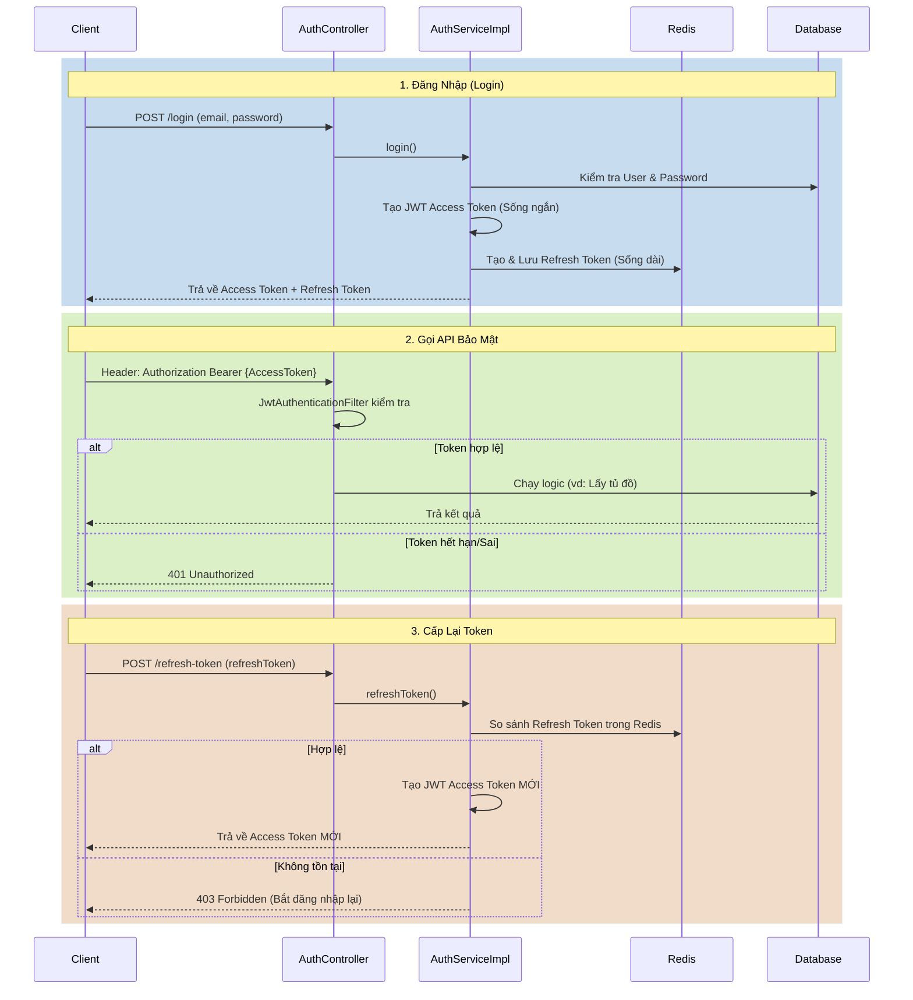
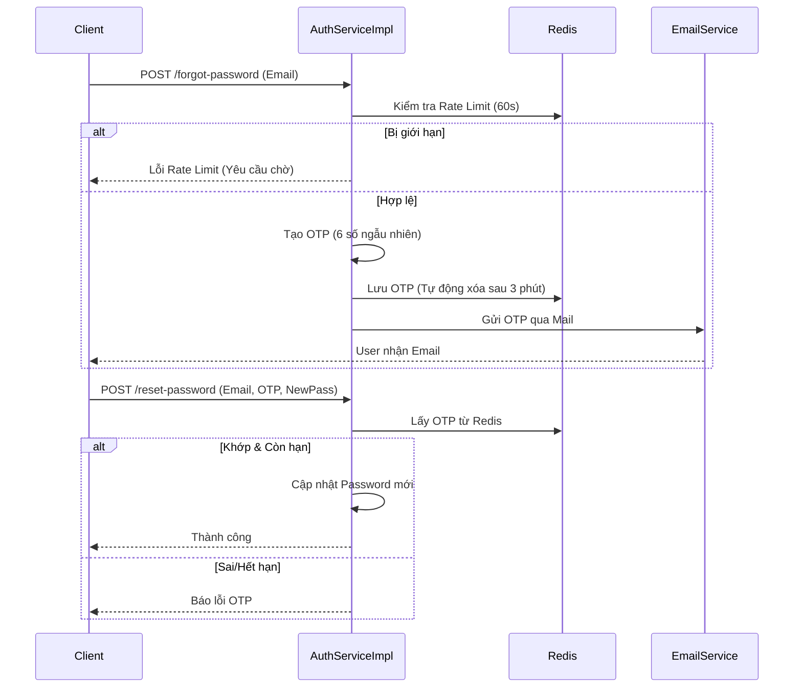
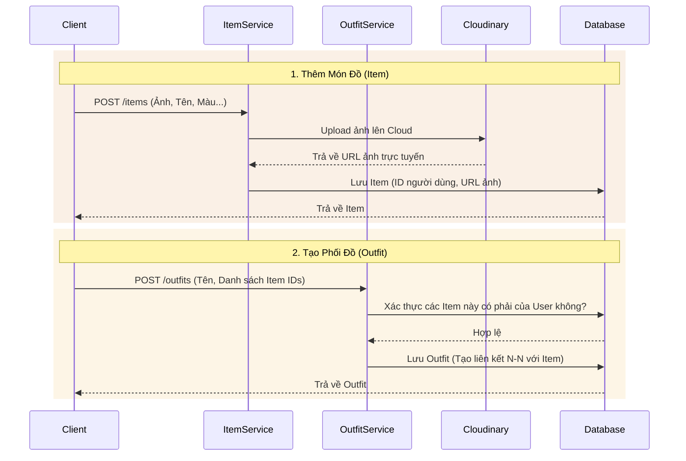
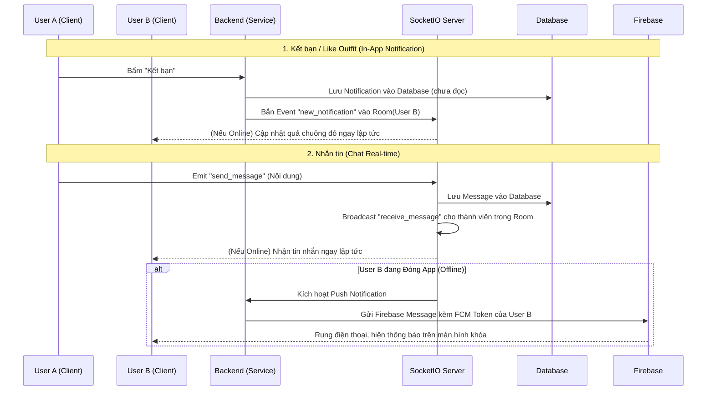

# 🌊 Kiến Trúc và Luồng Dữ Liệu (System Flows)

Dưới đây là các luồng xử lý (flow) quan trọng nhất trong hệ thống Wardrobe Services của bạn. Việc nắm rõ các luồng này sẽ giúp bạn hình dung bức tranh toàn cảnh, dễ dàng debug và phát triển thêm tính năng mà không sợ phá vỡ luồng hiện tại.

## 1. Luồng Xác thực (Authentication & Authorization Flow)
Hệ thống kết hợp **Stateless** (JWT) và **Stateful** (Redis lưu Refresh Token và OTP) để tối ưu hiệu năng và bảo mật.

## 2. Luồng Khôi Phục Mật Khẩu (Forgot Password)
Tận dụng tính năng tự động xóa (TTL) của Redis để quản lý vòng đời của OTP.

## 3. Luồng Quản Lý Tủ Đồ và Phối Đồ (Wardrobe & Outfit)
Giao tiếp với bên thứ 3 (Cloudinary) để lưu trữ hình ảnh trước khi ghi vào Database.

## 4. Luồng Nhắn Tin và Thông Báo (Real-time & Social)
Luồng phức tạp nhất kết hợp giữa HTTP Rest API, WebSockets và Push Notifications.

## 🔄 Tóm tắt Vòng Đời Dữ Liệu (Data Pipeline)
1. **Client -> Server**: Mọi Request đều phải đi qua `JwtAuthenticationFilter`. Không có Token hoặc Token hết hạn -> Bị đá văng ngay lập tức.
2. **Controller**: Lớp bề mặt. Chỉ làm nhiệm vụ nhận JSON (Request DTO), gọi Service, rồi đóng gói kết quả thành JSON (Response DTO). KHÔNG chứa logic nghiệp vụ.
3. **Service**: "Não bộ" của hệ thống. Kiểm tra quyền sở hữu, tính toán dữ liệu, gọi các dịch vụ bên ngoài (Firebase, Cloudinary) và tương tác với Database.
4. **Bảo mật sở hữu (Row-Level Security bằng Code)**: Xuyên suốt các Service (`Outfit`, `Item`, `Notification`), luôn có logic: `if (!item.getUser().getId().equals(currentUser.getId())) throw UNAUTHORIZED`. Điều này đảm bảo User A không bao giờ sửa hoặc xóa trộm đồ của User B được.
