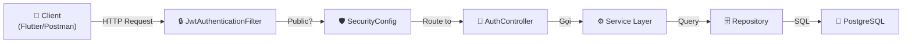
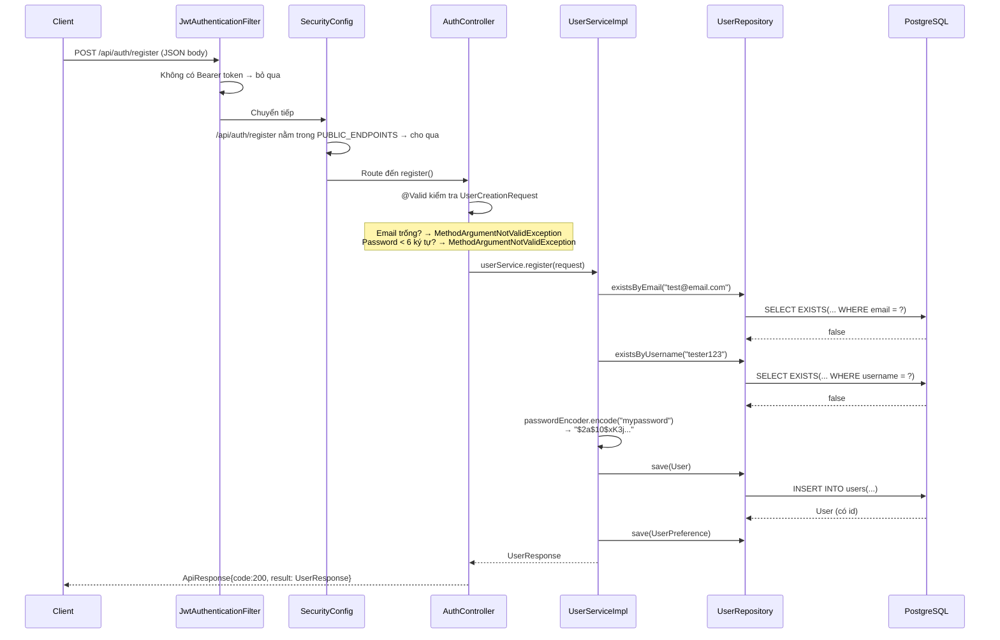
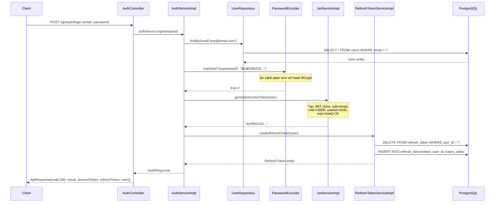
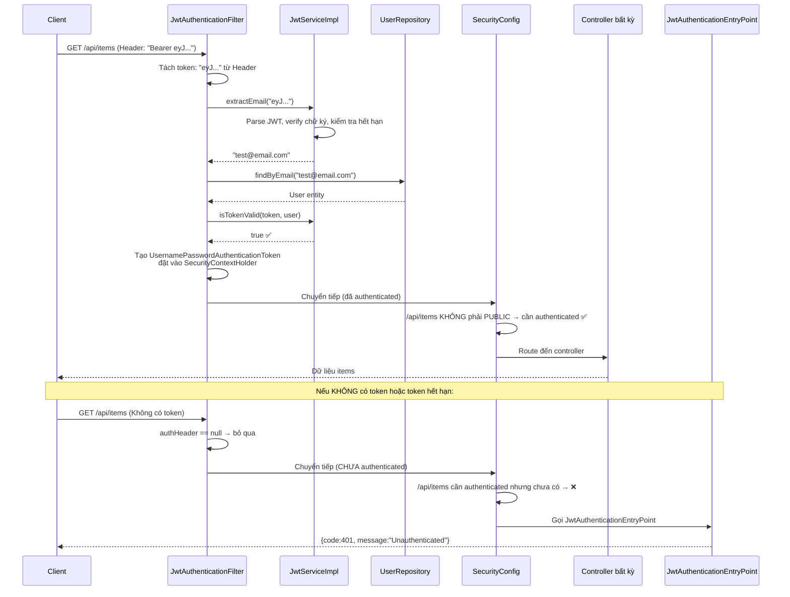
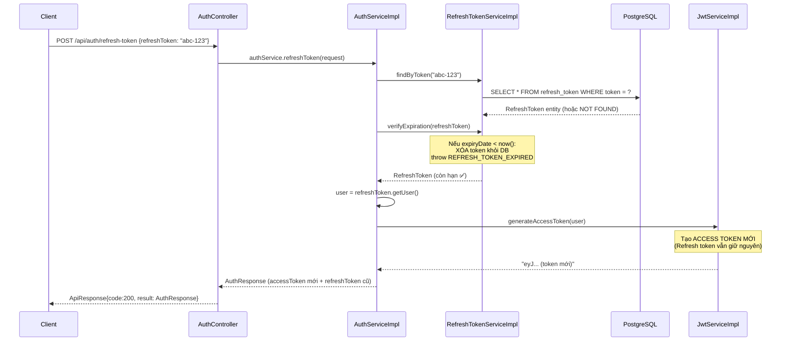
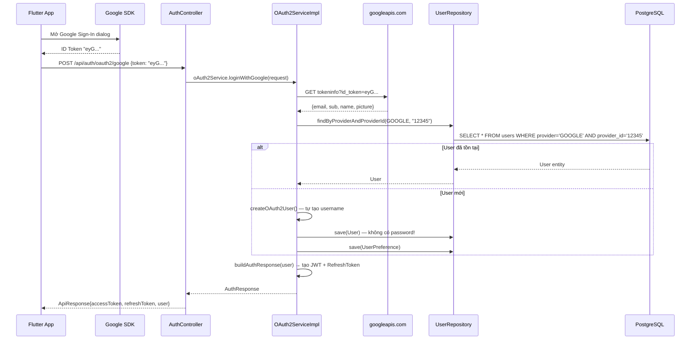
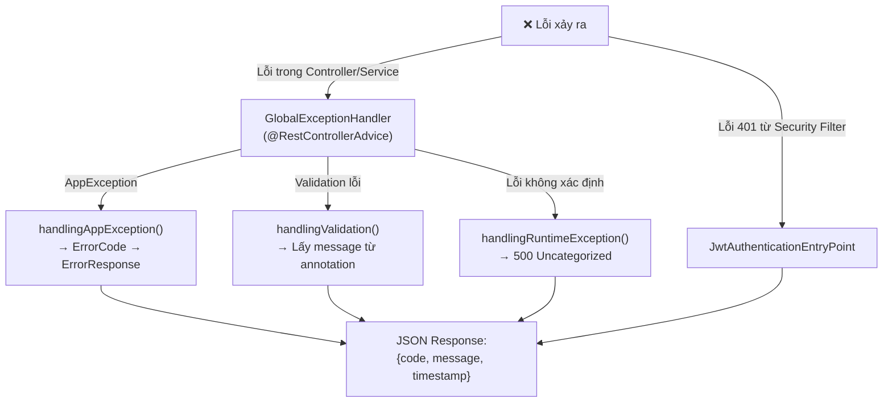

# Giải thích Toàn bộ Luồng Authentication — Từ Request đến Response

Tài liệu này giải thích **từng bước** khi một HTTP request đi vào hệ thống, qua những file nào, xử lý gì, và trả về kết quả như thế nào. Mỗi flow có sơ đồ minh họa để bạn dễ hình dung và debug.

---

## Kiến trúc Tổng quan



**Thứ tự xử lý mỗi request:**
1. `JwtAuthenticationFilter` — Kiểm tra Bearer token (nếu có)
2. `SecurityConfig` — Cho phép hoặc chặn request
3. `AuthController` — Nhận request, gọi service
4. `Service` — Xử lý logic nghiệp vụ
5. `Repository` — Truy vấn Database
6. Nếu có lỗi → `GlobalExceptionHandler` bắt và trả JSON chuẩn

---

## Flow 1: Đăng ký (`POST /api/auth/register`)



### Các file liên quan & vai trò:

| Bước | File | Dòng quan trọng | Vai trò |
|------|------|-----------------|---------|
| 1 | [JwtAuthenticationFilter](file:///c:/Users/Nghia/IdeaProjects/fashion-outfit-suggestions-application/wardrobe-services/src/main/java/com/example/wardrobeservices/config/JwtAuthenticationFilter.java#L40-L42) | `if (authHeader == null)` | Không có token → bỏ qua, cho request đi tiếp |
| 2 | [SecurityConfig](file:///c:/Users/Nghia/IdeaProjects/fashion-outfit-suggestions-application/wardrobe-services/src/main/java/com/example/wardrobeservices/config/SecurityConfig.java#L23-L31) | `PUBLIC_ENDPOINTS` | `/api/auth/register` nằm trong danh sách → `permitAll()` |
| 3 | [AuthController](file:///c:/Users/Nghia/IdeaProjects/fashion-outfit-suggestions-application/wardrobe-services/src/main/java/com/example/wardrobeservices/controller/AuthController.java#L28-L32) | `@Valid UserCreationRequest` | Spring tự động validate các annotation `@NotBlank`, `@Email`, `@Size` |
| 4 | [UserServiceImpl](file:///c:/Users/Nghia/IdeaProjects/fashion-outfit-suggestions-application/wardrobe-services/src/main/java/com/example/wardrobeservices/service/impl/UserServiceImpl.java#L29-L34) | `existsByEmail()`, `existsByUsername()` | Kiểm tra trùng lặp trước khi insert |
| 5 | [UserServiceImpl](file:///c:/Users/Nghia/IdeaProjects/fashion-outfit-suggestions-application/wardrobe-services/src/main/java/com/example/wardrobeservices/service/impl/UserServiceImpl.java#L39) | `passwordEncoder.encode()` | Băm mật khẩu bằng BCrypt (strength=10) |

### Debug tips:
- **Lỗi 400 "Email is mandatory"** → Body JSON thiếu trường `email` hoặc gửi rỗng. Kiểm tra `UserCreationRequest`
- **Lỗi 400 "Email already existed"** → Database đã có email này. Query: `SELECT * FROM users WHERE email = ?`
- **Lỗi 500 khi save** → Có thể do database constraint (email/username unique). Kiểm tra log Hibernate

---

## Flow 2: Đăng nhập (`POST /api/auth/login`)



### Giải thích JWT Token (bên trong `JwtServiceImpl`):

```
Token: eyJhbGciOiJIUzI1NiJ9.eyJyb2xlIjoiVVNFUiIsInVzZXJJZCI6Ii4uLiIsInN1YiI6InRlc3RAZW1haWwuY29tIiwiaWF0IjoxNjk5..., ... }
                ↑ Header                    ↑ Payload (Claims)                                                            ↑ Signature
```

**Payload chứa:**
- `sub` = email (subject)
- `role` = "USER"
- `userId` = UUID
- `iat` = thời điểm tạo
- `exp` = thời điểm hết hạn (iat + 1 giờ)

### Debug tips:
- **Lỗi 401 "Invalid email or password"** → 2 nguyên nhân:
  - Email không tồn tại trong DB → `findByEmail` trả `Optional.empty()`
  - Mật khẩu sai → `passwordEncoder.matches()` trả `false`
  - Cả 2 trường hợp đều dùng cùng message để tránh lộ thông tin (security best practice)
- **Decode JWT để debug**: Truy cập [jwt.io](https://jwt.io), paste token vào → xem nội dung payload

---

## Flow 3: Truy cập API được bảo vệ (ví dụ: `GET /api/items`)

Đây là flow **quan trọng nhất** cần hiểu vì nó xảy ra ở **MỌI request** đến API bảo vệ.



### Giải thích `SecurityContextHolder`:
Đây là nơi Spring Security lưu thông tin **"Ai đang gọi request này?"**. Khi `JwtAuthenticationFilter` xác thực thành công, nó đặt `Authentication` object vào đây. Sau đó bất kỳ Controller/Service nào cũng có thể lấy thông tin user hiện tại:

```java
// Trong bất kỳ Controller nào
User currentUser = (User) SecurityContextHolder.getContext()
    .getAuthentication().getPrincipal();
```

### Debug tips:
- **Lỗi 401 "Unauthenticated"** → Kiểm tra:
  1. Có gửi header `Authorization: Bearer <token>` không?
  2. Token đã hết hạn chưa? (decode tại jwt.io, xem trường `exp`)
  3. Secret key giữa tạo token và verify token có khớp nhau không? (kiểm tra `application.yml`)
- **Log**: `JwtAuthenticationFilter` sẽ in `JWT authentication failed: ...` ra console nếu token lỗi

---

## Flow 4: Làm mới Token (`POST /api/auth/refresh-token`)



### Tại sao cần Refresh Token?
- **Access Token** sống ngắn (1 giờ) → an toàn nhưng hết hạn nhanh
- **Refresh Token** sống dài (7 ngày) → dùng để lấy Access Token mới mà **không cần nhập lại mật khẩu**
- Nếu Refresh Token cũng hết hạn → buộc user đăng nhập lại

---

## Flow 5: OAuth2 Google (`POST /api/auth/oauth2/google`)



### Debug tips:
- **Lỗi 401 "Invalid OAuth2 token"** → Google ID Token không hợp lệ hoặc đã hết hạn. Thử lấy token mới từ Google OAuth Playground
- **User tạo mới nhưng thiếu thông tin** → Kiểm tra response từ Google API có trả `email` không (cần đúng scope)

---

## Flow 6: Xử lý Lỗi (Error Handling)

Mọi lỗi trong hệ thống đều đi qua **một trong hai cơ chế**:



### Giải thích chi tiết:

| Loại lỗi | Ai bắt? | ErrorCode | Ví dụ |
|-----------|---------|-----------|-------|
| Email trùng | `GlobalExceptionHandler` → `AppException` | `EMAIL_EXISTED` (400) | Đăng ký email đã có |
| Sai mật khẩu | `GlobalExceptionHandler` → `AppException` | `INVALID_CREDENTIALS` (401) | Đăng nhập sai pass |
| Validation failed | `GlobalExceptionHandler` → `MethodArgumentNotValidException` | `INVALID_KEY` (400) | Email rỗng, password < 6 ký tự |
| Không có token | `JwtAuthenticationEntryPoint` | 401 | Gọi API bảo vệ mà không gửi token |
| Token hết hạn | `JwtAuthenticationFilter` catch → tiếp tục không authenticate → `JwtAuthenticationEntryPoint` | 401 | Access token quá 1 giờ |
| Lỗi bất ngờ | `GlobalExceptionHandler` → `Exception` | `UNCATEGORIZED_EXCEPTION` (500) | NullPointer, DB connection lost |

### Luồng lỗi cụ thể — Ví dụ: User gửi email rỗng khi đăng ký:

```
1. Client gửi: POST /api/auth/register { "email": "", "username": "abc", "password": "123456" }
2. AuthController.register() có @Valid → Spring kiểm tra UserCreationRequest
3. @NotBlank trên field email → phát hiện email rỗng
4. Spring ném MethodArgumentNotValidException
5. GlobalExceptionHandler.handlingValidation() bắt được
6. Lấy message: "Email is mandatory" (từ @NotBlank annotation)
7. Trả về: { "code": 400, "message": "Email is mandatory", "timestamp": "..." }
```

---

## Bản đồ File — Khi debug, tìm file nào?

| Tôi cần debug... | Tìm trong file |
|---|---|
| Request có đến được Controller không? | [SecurityConfig.java](file:///c:/Users/Nghia/IdeaProjects/fashion-outfit-suggestions-application/wardrobe-services/src/main/java/com/example/wardrobeservices/config/SecurityConfig.java) — kiểm tra `PUBLIC_ENDPOINTS` |
| Token có hợp lệ không? | [JwtServiceImpl.java](file:///c:/Users/Nghia/IdeaProjects/fashion-outfit-suggestions-application/wardrobe-services/src/main/java/com/example/wardrobeservices/service/impl/JwtServiceImpl.java) — `isTokenValid()`, `extractAllClaims()` |
| Token bị từ chối ở đâu? | [JwtAuthenticationFilter.java](file:///c:/Users/Nghia/IdeaProjects/fashion-outfit-suggestions-application/wardrobe-services/src/main/java/com/example/wardrobeservices/config/JwtAuthenticationFilter.java) — log `JWT authentication failed` |
| Validation input bị lỗi? | [UserCreationRequest.java](file:///c:/Users/Nghia/IdeaProjects/fashion-outfit-suggestions-application/wardrobe-services/src/main/java/com/example/wardrobeservices/dto/request/UserCreationRequest.java) — các annotation `@NotBlank`, `@Email` |
| Lỗi 401 nhưng không rõ nguyên nhân? | [JwtAuthenticationEntryPoint.java](file:///c:/Users/Nghia/IdeaProjects/fashion-outfit-suggestions-application/wardrobe-services/src/main/java/com/example/wardrobeservices/config/JwtAuthenticationEntryPoint.java) |
| Lỗi trả về JSON kỳ lạ? | [GlobalExceptionHandler.java](file:///c:/Users/Nghia/IdeaProjects/fashion-outfit-suggestions-application/wardrobe-services/src/main/java/com/example/wardrobeservices/exception/GlobalExceptionHandler.java) |
| Mật khẩu lưu không đúng? | [SecurityConfig.java](file:///c:/Users/Nghia/IdeaProjects/fashion-outfit-suggestions-application/wardrobe-services/src/main/java/com/example/wardrobeservices/config/SecurityConfig.java) — `passwordEncoder()` bean |
| User OAuth2 không tạo được? | [OAuth2ServiceImpl.java](file:///c:/Users/Nghia/IdeaProjects/fashion-outfit-suggestions-application/wardrobe-services/src/main/java/com/example/wardrobeservices/service/impl/OAuth2ServiceImpl.java) — `createOAuth2User()` |
